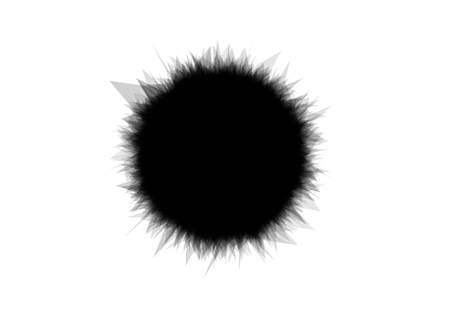
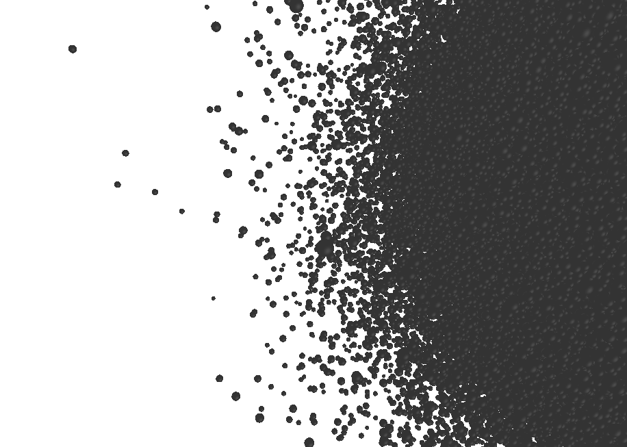
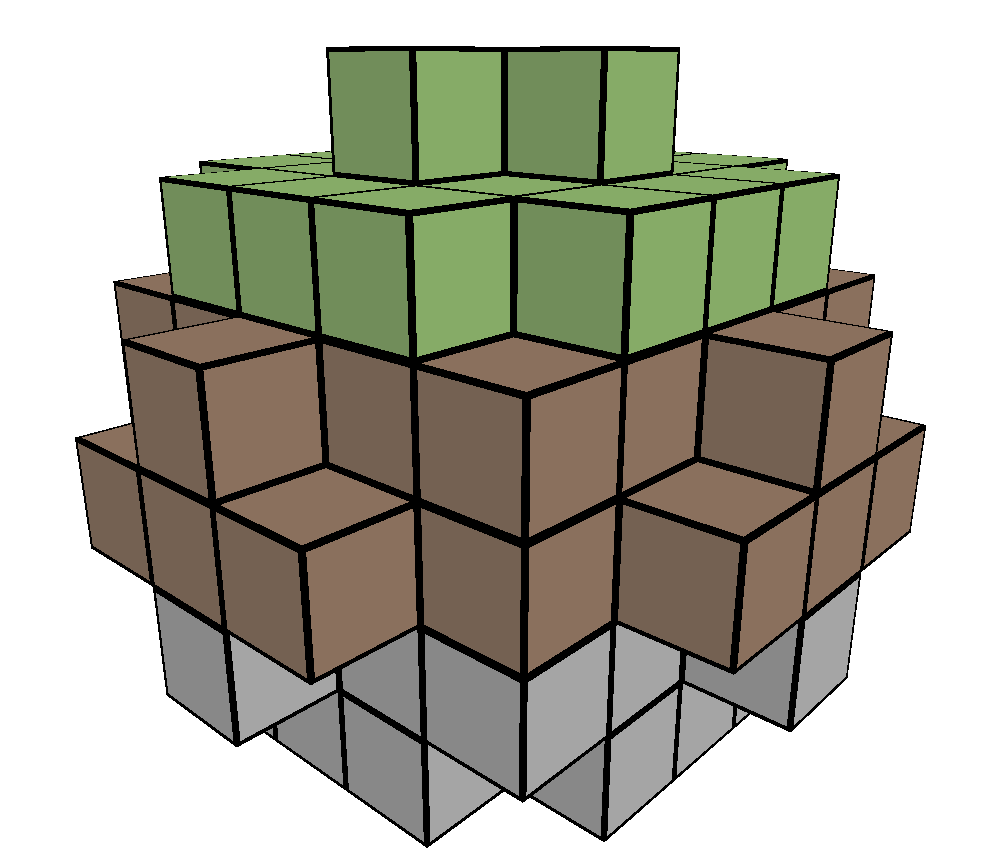

# JouleGL
Low level rendering framework using OpenGL python bindings. For feedback or questions, feel free to join my stream and community at https://www.twitch.tv/nojoule .

## Test Coverage
<!-- Pytest Coverage Comment:Begin -->
<a href="https://github.com/nojoule/joulegl/blob/main/README.md"></a><details><summary>Coverage Report </summary><table><tr><th>File</th><th>Stmts</th><th>Miss</th><th>Cover</th><th>Missing</th></tr><tbody><tr><td colspan="5"><b>joulegl/opengl_helper</b></td></tr><tr><td>&nbsp; &nbsp;<a href="https://github.com/nojoule/joulegl/blob/main/joulegl/opengl_helper/buffer.py">buffer.py</a></td><td>166</td><td>1</td><td>99%</td><td><a href="https://github.com/nojoule/joulegl/blob/main/joulegl/opengl_helper/buffer.py#L104">104</a></td></tr><tr><td>&nbsp; &nbsp;<a href="https://github.com/nojoule/joulegl/blob/main/joulegl/opengl_helper/frame_buffer.py">frame_buffer.py</a></td><td>33</td><td>0</td><td>100%</td><td>&nbsp;</td></tr><tr><td>&nbsp; &nbsp;<a href="https://github.com/nojoule/joulegl/blob/main/joulegl/opengl_helper/screenshot.py">screenshot.py</a></td><td>29</td><td>6</td><td>73%</td><td><a href="https://github.com/nojoule/joulegl/blob/main/joulegl/opengl_helper/screenshot.py#L27-L>29">27&ndash;>29</a>, <a href="https://github.com/nojoule/joulegl/blob/main/joulegl/opengl_helper/screenshot.py#L38-L40">38&ndash;40</a>, <a href="https://github.com/nojoule/joulegl/blob/main/joulegl/opengl_helper/screenshot.py#L58-L61">58&ndash;61</a></td></tr><tr><td>&nbsp; &nbsp;<a href="https://github.com/nojoule/joulegl/blob/main/joulegl/opengl_helper/texture.py">texture.py</a></td><td>46</td><td>9</td><td>71%</td><td><a href="https://github.com/nojoule/joulegl/blob/main/joulegl/opengl_helper/texture.py#L37-L38">37&ndash;38</a>, <a href="https://github.com/nojoule/joulegl/blob/main/joulegl/opengl_helper/texture.py#L46-L47">46&ndash;47</a>, <a href="https://github.com/nojoule/joulegl/blob/main/joulegl/opengl_helper/texture.py#L60-L62">60&ndash;62</a>, <a href="https://github.com/nojoule/joulegl/blob/main/joulegl/opengl_helper/texture.py#L65">65</a>, <a href="https://github.com/nojoule/joulegl/blob/main/joulegl/opengl_helper/texture.py#L74">74</a></td></tr><tr><td>&nbsp; &nbsp;<a href="https://github.com/nojoule/joulegl/blob/main/joulegl/opengl_helper/vertex_data_handler.py">vertex_data_handler.py</a></td><td>65</td><td>0</td><td>100%</td><td>&nbsp;</td></tr><tr><td colspan="5"><b>joulegl/opengl_helper/base</b></td></tr><tr><td>&nbsp; &nbsp;<a href="https://github.com/nojoule/joulegl/blob/main/joulegl/opengl_helper/base/data_set.py">data_set.py</a></td><td>41</td><td>0</td><td>100%</td><td>&nbsp;</td></tr><tr><td>&nbsp; &nbsp;<a href="https://github.com/nojoule/joulegl/blob/main/joulegl/opengl_helper/base/shader.py">shader.py</a></td><td>68</td><td>0</td><td>100%</td><td>&nbsp;</td></tr><tr><td>&nbsp; &nbsp;<a href="https://github.com/nojoule/joulegl/blob/main/joulegl/opengl_helper/base/shader_handler.py">shader_handler.py</a></td><td>18</td><td>0</td><td>100%</td><td>&nbsp;</td></tr><tr><td>&nbsp; &nbsp;<a href="https://github.com/nojoule/joulegl/blob/main/joulegl/opengl_helper/base/shader_parser.py">shader_parser.py</a></td><td>52</td><td>0</td><td>100%</td><td>&nbsp;</td></tr><tr><td colspan="5"><b>joulegl/opengl_helper/compute</b></td></tr><tr><td>&nbsp; &nbsp;<a href="https://github.com/nojoule/joulegl/blob/main/joulegl/opengl_helper/compute/shader.py">shader.py</a></td><td>36</td><td>0</td><td>100%</td><td>&nbsp;</td></tr><tr><td>&nbsp; &nbsp;<a href="https://github.com/nojoule/joulegl/blob/main/joulegl/opengl_helper/compute/shader_handler.py">shader_handler.py</a></td><td>15</td><td>0</td><td>100%</td><td>&nbsp;</td></tr><tr><td colspan="5"><b>joulegl/opengl_helper/render</b></td></tr><tr><td>&nbsp; &nbsp;<a href="https://github.com/nojoule/joulegl/blob/main/joulegl/opengl_helper/render/shader.py">shader.py</a></td><td>25</td><td>0</td><td>100%</td><td>&nbsp;</td></tr><tr><td>&nbsp; &nbsp;<a href="https://github.com/nojoule/joulegl/blob/main/joulegl/opengl_helper/render/shader_handler.py">shader_handler.py</a></td><td>21</td><td>0</td><td>100%</td><td>&nbsp;</td></tr><tr><td>&nbsp; &nbsp;<a href="https://github.com/nojoule/joulegl/blob/main/joulegl/opengl_helper/render/utility.py">utility.py</a></td><td>75</td><td>8</td><td>83%</td><td><a href="https://github.com/nojoule/joulegl/blob/main/joulegl/opengl_helper/render/utility.py#L126-L131">126&ndash;131</a>, <a href="https://github.com/nojoule/joulegl/blob/main/joulegl/opengl_helper/render/utility.py#L138">138</a>, <a href="https://github.com/nojoule/joulegl/blob/main/joulegl/opengl_helper/render/utility.py#L143">143</a>, <a href="https://github.com/nojoule/joulegl/blob/main/joulegl/opengl_helper/render/utility.py#L146">146</a>, <a href="https://github.com/nojoule/joulegl/blob/main/joulegl/opengl_helper/render/utility.py#L154-L155">154&ndash;155</a></td></tr><tr><td colspan="5"><b>joulegl/processing</b></td></tr><tr><td>&nbsp; &nbsp;<a href="https://github.com/nojoule/joulegl/blob/main/joulegl/processing/processor.py">processor.py</a></td><td>9</td><td>0</td><td>100%</td><td>&nbsp;</td></tr><tr><td colspan="5"><b>joulegl/rendering</b></td></tr><tr><td>&nbsp; &nbsp;<a href="https://github.com/nojoule/joulegl/blob/main/joulegl/rendering/renderer.py">renderer.py</a></td><td>34</td><td>0</td><td>100%</td><td>&nbsp;</td></tr><tr><td colspan="5"><b>joulegl/utility</b></td></tr><tr><td>&nbsp; &nbsp;<a href="https://github.com/nojoule/joulegl/blob/main/joulegl/utility/app.py">app.py</a></td><td>57</td><td>2</td><td>97%</td><td><a href="https://github.com/nojoule/joulegl/blob/main/joulegl/utility/app.py#L85-L86">85&ndash;86</a></td></tr><tr><td>&nbsp; &nbsp;<a href="https://github.com/nojoule/joulegl/blob/main/joulegl/utility/camera.py">camera.py</a></td><td>142</td><td>14</td><td>90%</td><td><a href="https://github.com/nojoule/joulegl/blob/main/joulegl/utility/camera.py#L141-L155">141&ndash;155</a>, <a href="https://github.com/nojoule/joulegl/blob/main/joulegl/utility/camera.py#L222-L225">222&ndash;225</a></td></tr><tr><td>&nbsp; &nbsp;<a href="https://github.com/nojoule/joulegl/blob/main/joulegl/utility/definitions.py">definitions.py</a></td><td>14</td><td>0</td><td>100%</td><td>&nbsp;</td></tr><tr><td>&nbsp; &nbsp;<a href="https://github.com/nojoule/joulegl/blob/main/joulegl/utility/file.py">file.py</a></td><td>72</td><td>0</td><td>100%</td><td>&nbsp;</td></tr><tr><td>&nbsp; &nbsp;<a href="https://github.com/nojoule/joulegl/blob/main/joulegl/utility/glcontext.py">glcontext.py</a></td><td>14</td><td>0</td><td>100%</td><td>&nbsp;</td></tr><tr><td>&nbsp; &nbsp;<a href="https://github.com/nojoule/joulegl/blob/main/joulegl/utility/log_handling.py">log_handling.py</a></td><td>15</td><td>0</td><td>100%</td><td>&nbsp;</td></tr><tr><td>&nbsp; &nbsp;<a href="https://github.com/nojoule/joulegl/blob/main/joulegl/utility/performance.py">performance.py</a></td><td>54</td><td>21</td><td>59%</td><td><a href="https://github.com/nojoule/joulegl/blob/main/joulegl/utility/performance.py#L13-L38">13&ndash;38</a>, <a href="https://github.com/nojoule/joulegl/blob/main/joulegl/utility/performance.py#L54-L55">54&ndash;55</a>, <a href="https://github.com/nojoule/joulegl/blob/main/joulegl/utility/performance.py#L62-L66">62&ndash;66</a>, <a href="https://github.com/nojoule/joulegl/blob/main/joulegl/utility/performance.py#L71-L>75">71&ndash;>75</a></td></tr><tr><td>&nbsp; &nbsp;<a href="https://github.com/nojoule/joulegl/blob/main/joulegl/utility/singleton.py">singleton.py</a></td><td>10</td><td>0</td><td>100%</td><td>&nbsp;</td></tr><tr><td>&nbsp; &nbsp;<a href="https://github.com/nojoule/joulegl/blob/main/joulegl/utility/window.py">window.py</a></td><td>173</td><td>85</td><td>40%</td><td><a href="https://github.com/nojoule/joulegl/blob/main/joulegl/utility/window.py#L18">18</a>, <a href="https://github.com/nojoule/joulegl/blob/main/joulegl/utility/window.py#L23-L26">23&ndash;26</a>, <a href="https://github.com/nojoule/joulegl/blob/main/joulegl/utility/window.py#L35">35</a>, <a href="https://github.com/nojoule/joulegl/blob/main/joulegl/utility/window.py#L39-L41">39&ndash;41</a>, <a href="https://github.com/nojoule/joulegl/blob/main/joulegl/utility/window.py#L56">56</a>, <a href="https://github.com/nojoule/joulegl/blob/main/joulegl/utility/window.py#L105-L106">105&ndash;106</a>, <a href="https://github.com/nojoule/joulegl/blob/main/joulegl/utility/window.py#L114-L116">114&ndash;116</a>, <a href="https://github.com/nojoule/joulegl/blob/main/joulegl/utility/window.py#L119">119</a>, <a href="https://github.com/nojoule/joulegl/blob/main/joulegl/utility/window.py#L122-L133">122&ndash;133</a>, <a href="https://github.com/nojoule/joulegl/blob/main/joulegl/utility/window.py#L136-L142">136&ndash;142</a>, <a href="https://github.com/nojoule/joulegl/blob/main/joulegl/utility/window.py#L145-L148">145&ndash;148</a>, <a href="https://github.com/nojoule/joulegl/blob/main/joulegl/utility/window.py#L151-L158">151&ndash;158</a>, <a href="https://github.com/nojoule/joulegl/blob/main/joulegl/utility/window.py#L161-L189">161&ndash;189</a>, <a href="https://github.com/nojoule/joulegl/blob/main/joulegl/utility/window.py#L203-L209">203&ndash;209</a>, <a href="https://github.com/nojoule/joulegl/blob/main/joulegl/utility/window.py#L217">217</a>, <a href="https://github.com/nojoule/joulegl/blob/main/joulegl/utility/window.py#L230">230</a>, <a href="https://github.com/nojoule/joulegl/blob/main/joulegl/utility/window.py#L232">232</a>, <a href="https://github.com/nojoule/joulegl/blob/main/joulegl/utility/window.py#L236">236</a>, <a href="https://github.com/nojoule/joulegl/blob/main/joulegl/utility/window.py#L243">243</a>, <a href="https://github.com/nojoule/joulegl/blob/main/joulegl/utility/window.py#L249-L252">249&ndash;252</a>, <a href="https://github.com/nojoule/joulegl/blob/main/joulegl/utility/window.py#L255-L258">255&ndash;258</a>, <a href="https://github.com/nojoule/joulegl/blob/main/joulegl/utility/window.py#L266-L>268">266&ndash;>268</a></td></tr><tr><td>&nbsp; &nbsp;<a href="https://github.com/nojoule/joulegl/blob/main/joulegl/utility/window_config.py">window_config.py</a></td><td>15</td><td>0</td><td>100%</td><td>&nbsp;</td></tr><tr><td><b>TOTAL</b></td><td><b>1299</b></td><td><b>146</b></td><td><b>86%</b></td><td>&nbsp;</td></tr></tbody></table></details>
<!-- Pytest Coverage Comment:End -->

## Installation

Install using pip:
```Shell
pip install -r requirements.txt
```

## Usage

Clone this repo and look in the [demo](./demo) folder for examples.

### Demo: Balls
Showing compute shader applying noise to vertex positions with dynamic use of two different shader for basic triangles or more complex geometry shader.

```Shell
python demo/balls/balls.py
```




### Demo: Block
Showcasing dynamic shader generation.

```Shell
python demo/block/block.py
```

